<h3><code>priyanxu05@github ~ $ ./contributions.sh</code></h3>

  

<h3><code>priyanxu05@github ~ $ whoami</code></h3>

<table>
  <tr>

    <td valign="top">
      
    </td>

    <td valign="top">
      
    </td>

  </tr>
</table>

 

<h3><code>priyanxu05@github ~ $ connect</code></h3>

 

<h3><code>priyanxu05@github ~ $ skills</code></h3>

 

 

 

<code>priyanxu05@github ~ $ echo "Building. Learning. Solving."</code>

